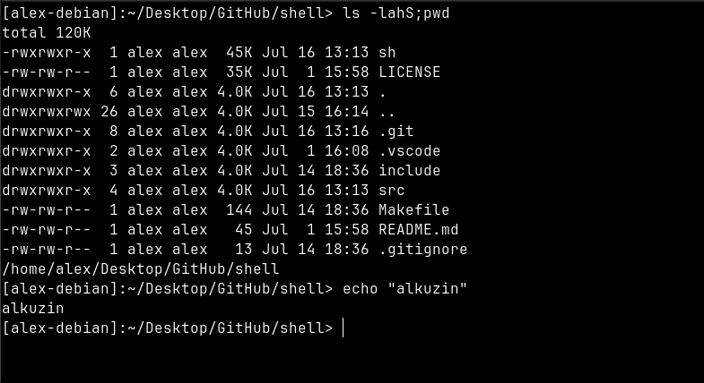

# shell

Simple implementation of Linux shell (Linux debian v6.9.7).

Supports several builtin commands:

* echo (support `-n` option)
* cd 
* clear
* exit
* export
* pwd

Able to use `;` as commands separator.



## Installation

First clone this repository:
```console
https://github.com/alkuzin/shell.git
```

Then move to the `shell/` directory:
```console
cd shell/
```

To build and run project use:
```console
make all && ./sh
```

To return everything to original state:
```console
make fclean
```